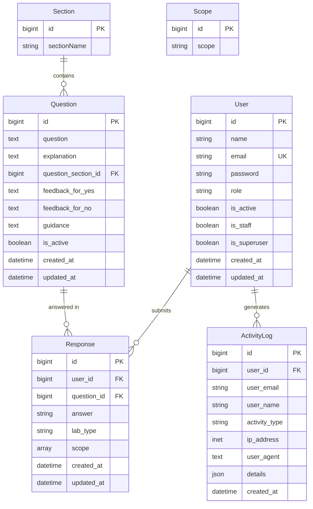

# EEE Readiness Assessment Portal — System Architecture & API Documentation

## Executive Overview
The **EEE Readiness Assessment Portal** is a web-based platform designed for forensic laboratory readiness evaluation. It allows laboratory applicants to register, complete comprehensive readiness assessment questionnaires across multiple technical sections, preview and edit their responses, generate printer-friendly PDF compliance reports, and download historical reports upon return. Administrators can manage assessment questions, sections, scope specialisations, and audit activity logs.

---

## Application Features

### 1. User Authentication & Session Management
- **User Registration & Login:** JWT-based authentication featuring access tokens and HttpOnly refresh cookies. Supports role-based access control (`applicant` vs `admin`).
- **Session Restoration & Auto-Fill:** When an applicant re-logs into the portal, their saved or previously submitted assessment answers, lab type, and scope specialisations are automatically pre-filled into the assessment workflow.
- **Secure Logout on Report Download:** Completing an assessment and initiating a report download automatically clears session tokens and securely logs out the user.

### 2. Interactive Assessment Workflow
- **Multi-Section Questionnaires:** Questions organized logically into customizable assessment sections (e.g., *Personnel Requirements*, *Equipment & Calibration*, *Quality Assurance*).
- **Real-Time Progress Tracking:** Header progress bar and section sidebar indicators reflect completion percentage and remaining unanswered questions in real time.
- **Section Navigation & Answer Clearing:** Instant section jumping with validation; ability to clear section responses with user confirmation.
- **Rich Text / Formatting Support:** Markdown-style formatting (`**bold**`) support across question text, explanations, and remediation guidance.

### 3. Assessment Response Preview Modal
- **Pre-Submission Review:** Prior to final submission, applicants can open a full-screen response preview modal.
- **Detailed Summary & Compliance Breakdown:** Displays applicant metadata, lab type, scope list, total questions answered, and calculated compliance score (`X / Y (Z%)`).
- **Section Breakdown with Color-Coded Indicators:** Interactive view of all answers (`✓ YES` in green, `✕ NO` in red) with question text and context.
- **Dual Modal Action:**
  - **Edit Answers (`✏️ Edit Answers`):** Dismisses the preview modal and returns the user directly to the assessment form for modifications.
  - **Final Submit (`✓ Final Submit`):** Commits all responses to the database, clears local session storage, and proceeds to the completion view.

### 4. PDF Compliance Report Generation
- **Client-Side Vector PDF Rendering:** High-resolution PDF generation built using `jsPDF` and `jspdf-autotable`.
- **Dual Output Styles:**
  - **Full Color Report:** Styled header banners, color-coded pass/fail badges, section summary charts, and detailed compliance breakdown.
  - **Printer-Friendly (Black & White):** Optimized high-contrast design for physical printing and official submission filing.
- **Historical Report Download:** Returning applicants with existing submissions can immediately download their previous PDF assessment report directly from the restored notification banner.

### 5. Administrative Dashboard & Management
- **Question Management:** Full CRUD operations on assessment questions, including soft-activation toggles (`is_active`).
- **Section & Scope Management:** Dynamic management of laboratory types, specialisation scopes, and section orderings.
- **Applicant Assessment Oversight:** Admins can view individual user submission responses, total response statistics, and export response datasets to CSV format.
- **Security Audit Logs:** Automated logging of critical user activities (logins, failed attempts, password resets, question creation/edits/deletions, and assessment submissions) captured with IP address and User Agent metadata.

---

## Database Design & Entity-Relationship Model

The backend is powered by Django ORM connected to PostgreSQL / SQLite.

---

### Detailed Model Specifications

#### 1. `User` Model (`db_table: users`)
Represents portal users (Applicants and Administrators). Extends Django's `AbstractBaseUser` and `PermissionsMixin`.

| Attribute | Data Type | Constraints / Options | Description |
| :--- | :--- | :--- | :--- |
| `id` | `BigAutoField` | Primary Key, Auto Increment | Unique user identifier |
| `name` | `CharField(150)` | `blank=False` | Full name of user |
| `email` | `EmailField` | **Unique**, `USERNAME_FIELD` | User login email address |
| `password` | `CharField(128)` | Standard Django password hash | Hashed user password |
| `role` | `CharField(10)` | Choices: `admin`, `applicant`; Default: `applicant` | User authorization role |
| `is_active` | `BooleanField` | Default: `True` | Account active status |
| `is_staff` | `BooleanField` | Default: `False` | Access to Django admin backend |
| `is_superuser` | `BooleanField` | Default: `False` | Superuser privileges |
| `created_at` | `DateTimeField` | `auto_now_add=True` | Timestamp when user registered |
| `updated_at` | `DateTimeField` | `auto_now=True` | Timestamp when user record last modified |

**Relationships:**
- **One-to-Many** with `Response` (`related_name='responses'`, `on_delete=CASCADE`).
- **One-to-Many** with `ActivityLog` (`related_name='activity_logs'`, `on_delete=SET_NULL`).

---

#### 2. `Section` Model (`db_table: questions_section`)
Defines assessment modules/sections.

| Attribute | Data Type | Constraints / Options | Description |
| :--- | :--- | :--- | :--- |
| `id` | `BigAutoField` | Primary Key, Auto Increment | Unique section identifier |
| `sectionName` | `CharField(100)` | `blank=False` | Title of section (e.g. "Quality Management") |

**Relationships:**
- **One-to-Many** with `Question` (`related_name='questions'`, `on_delete=CASCADE`).

---

#### 3. `Scope` Model (`db_table: questions_scope`)
Defines laboratory domain specialisations.

| Attribute | Data Type | Constraints / Options | Description |
| :--- | :--- | :--- | :--- |
| `id` | `BigAutoField` | Primary Key, Auto Increment | Unique scope identifier |
| `scope` | `CharField(100)` | `blank=False` | Specialisation title (e.g. "Digital Forensics") |

---

#### 4. `Question` Model (`db_table: questions`)
Represents an individual assessment question.

| Attribute | Data Type | Constraints / Options | Description |
| :--- | :--- | :--- | :--- |
| `id` | `BigAutoField` | Primary Key, Auto Increment | Unique question identifier |
| `question` | `TextField` | `blank=False` | The question text shown to applicants |
| `explanation` | `TextField` | `blank=True` | Contextual / regulatory explanation |
| `question_section` | `ForeignKey` | FK -> `Section.id`, `on_delete=CASCADE`, `null=True` | Section this question belongs to |
| `feedback_for_yes` | `TextField` | `blank=True` | Guidance provided when answered 'yes' |
| `feedback_for_no` | `TextField` | `blank=True` | Guidance / remediation when answered 'no' |
| `guidance` | `TextField` | `blank=True` | General compliance guidance / standards reference |
| `is_active` | `BooleanField` | Default: `True` | Soft-delete / active status for assessment |
| `created_at` | `DateTimeField` | `auto_now_add=True` | Record creation timestamp |
| `updated_at` | `DateTimeField` | `auto_now=True` | Record update timestamp |

**Relationships:**
- **Many-to-One** with `Section`.
- **One-to-Many** with `Response` (`related_name='responses'`, `on_delete=PROTECT`).

---

#### 5. `Response` Model (`db_table: responses`)
Stores an applicant's answer to a single question.

| Attribute | Data Type | Constraints / Options | Description |
| :--- | :--- | :--- | :--- |
| `id` | `BigAutoField` | Primary Key, Auto Increment | Unique response record identifier |
| `user` | `ForeignKey` | FK -> `User.id`, `on_delete=CASCADE`, `related_name='responses'` | Applicant who answered |
| `question` | `ForeignKey` | FK -> `Question.id`, `on_delete=PROTECT`, `related_name='responses'` | Question being answered |
| `answer` | `CharField(10)` | Choices: `yes`, `no` | Applicant's answer choice |
| `lab_type` | `CharField(100)` | `blank=True` | Type of laboratory (e.g. "Government", "Private") |
| `scope` | `ArrayField(CharField)` | PostgreSQL Array or JSON fallback, Default: `list` | Laboratory specialisation scope list |
| `created_at` | `DateTimeField` | `auto_now_add=True` | Response creation timestamp |
| `updated_at` | `DateTimeField` | `auto_now=True` | Response last updated timestamp |

**Constraints:**
- **`unique_together = ('user', 'question')`**: Ensures a user has at most one response per question (supports upsert logic on re-submission).

---

#### 6. `ActivityLog` Model (`db_table: activity_logs`)
Stores security and operational audit logs.

| Attribute | Data Type | Constraints / Options | Description |
| :--- | :--- | :--- | :--- |
| `id` | `BigAutoField` | Primary Key, Auto Increment | Unique log entry identifier |
| `user` | `ForeignKey` | FK -> `User.id`, `on_delete=SET_NULL`, `null=True`, `blank=True` | User related to activity |
| `user_email` | `CharField(255)` | `blank=True` | Cached user email address |
| `user_name` | `CharField(150)` | `blank=True` | Cached user full name |
| `activity_type` | `CharField(30)` | Choices: `login_success`, `login_failed`, `submission`, `password_reset`, `question_created`, `question_updated`, `question_deleted`, `question_toggled` | Type of event logged |
| `ip_address` | `GenericIPAddressField` | `null=True`, `blank=True` | Originating IP address of request |
| `user_agent` | `TextField` | `blank=True` | Client browser User-Agent string |
| `details` | `JSONField` | Default: `{}` | Additional event context data |
| `created_at` | `DateTimeField` | `auto_now_add=True` | Timestamp when event occurred |

---

## Complete API Reference

Base URL prefix: `/api/` (or root context dependent on proxy configuration)

### 1. Authentication & User Management (`/auth/`)

| Method | Endpoint | Access Level | Description | Request Body | Success Response |
| :--- | :--- | :--- | :--- | :--- | :--- |
| `POST` | `/auth/register/` | Public | Register new user account | `{ "name": "John Doe", "email": "john@example.com", "password": "Password123", "role": "applicant" }` | `201 Created` `{ "user": {...}, "tokens": { "access": "...", "refresh": "..." } }` |
| `POST` | `/auth/login/` | Public | Authenticate user and receive tokens | `{ "email": "john@example.com", "password": "Password123" }` | `200 OK` `{ "user": {...}, "tokens": { "access": "...", "refresh": "..." } }` |
| `POST` | `/auth/logout/` | Public | Logout user & clear refresh token cookie | None | `200 OK` `{ "message": "Logged out successfully" }` |
| `POST` | `/auth/token/refresh/` | Public / Cookie | Refresh JWT access token | `{ "refresh": "..." }` *(or HttpOnly Cookie)* | `200 OK` `{ "access": "...", "refresh": "..." }` |
| `GET` | `/auth/profile/` | Authenticated | Get current authenticated user profile | None | `200 OK` `{ "id": 1, "name": "John Doe", "email": "john@example.com", "role": "applicant" }` |
| `GET` | `/auth/get-user/` | Authenticated | List all registered users | None | `200 OK` `[ { "id": 1, "name": "...", "email": "...", "role": "..." } ]` |
| `POST` | `/auth/reset-password/` | Public | Reset user password via email | `{ "email": "john@example.com", "new_password": "NewPassword123" }` | `200 OK` `{ "message": "Password has been reset successfully." }` |
| `GET` | `/auth/activity-logs/` | Admin | Retrieve security audit activity logs | None | `200 OK` `[ { "id": 1, "activity_type": "login_success", "ip_address": "...", "created_at": "..." } ]` |

---

### 2. Questions, Sections & Scopes (`/questions/`)

#### Questions (`/questions/`)
| Method | Endpoint | Access Level | Description | Request Body | Success Response |
| :--- | :--- | :--- | :--- | :--- | :--- |
| `GET` | `/questions/` | Public / Auth | List questions (active only for users; all for admins) | None | `200 OK` `[ { "id": 1, "question": "...", "question_section": 1, "is_active": true } ]` |
| `GET` | `/questions/active/` | Authenticated | Retrieve active questions for assessment flow | None | `200 OK` `[ { "id": 1, "question": "...", "explanation": "..." } ]` |
| `GET` | `/questions/all/` | Admin | Retrieve all questions (including inactive) | None | `200 OK` `[ { "id": 1, "question": "...", "is_active": false } ]` |
| `POST` | `/questions/create/` | Admin | Create single or multiple questions | `[ { "question": "...", "explanation": "...", "question_section": 1 } ]` | `201 Created` `[ { "id": 10, "question": "..." } ]` |
| `PUT / PATCH` | `/questions/update/` | Admin | Update question by ID in payload | `{ "id": 10, "question": "Updated question text", "is_active": true }` | `200 OK` `{ "message": "Question updated successfully", "data": {...} }` |
| `PATCH` | `/questions/{id}/toggle-active/` | Admin | Toggle question active status | None | `200 OK` `{ "id": 10, "is_active": false }` |
| `DELETE` | `/questions/{id}/delete/` | Admin | Delete question by ID | None | `200 OK` `{ "id": 10, "message": "Question deleted successfully" }` |

#### Sections (`/questions/sections/`)
| Method | Endpoint | Access Level | Description | Request Body | Success Response |
| :--- | :--- | :--- | :--- | :--- | :--- |
| `GET` | `/questions/sections/get/` | Authenticated | Get all assessment sections | None | `200 OK` `{ "sections": [ { "id": 1, "sectionName": "Personnel" } ] }` |
| `POST` | `/questions/sections/create/` | Admin | Create new assessment section | `{ "sectionName": "Quality Control" }` | `200 OK` `{ "message": "Section created successfully" }` |
| `PUT / PATCH` | `/questions/sections/update/` | Admin | Update section name by ID | `{ "id": 1, "sectionName": "Updated Section" }` | `200 OK` `{ "message": "Section updated successfully" }` |
| `DELETE` | `/questions/sections/delete/` | Admin | Delete section by ID | `{ "id": 1 }` | `200 OK` `{ "message": "Section deleted successfully" }` |

#### Scopes (`/questions/scopes/`)
| Method | Endpoint | Access Level | Description | Request Body | Success Response |
| :--- | :--- | :--- | :--- | :--- | :--- |
| `GET` | `/questions/scopes/get/` | Authenticated | Get all lab specialisation scopes | None | `200 OK` `{ "scopes": [ { "id": 1, "scope": "Digital Forensics" } ] }` |
| `POST` | `/questions/scopes/create/` | Admin | Create new scope | `{ "scope": "Ballistics" }` | `200 OK` `{ "message": "Scope created successfully" }` |
| `PUT / PATCH` | `/questions/scopes/update/` | Admin | Update scope name | `{ "id": 1, "scope": "Updated Scope" }` | `200 OK` `{ "message": "Scope updated successfully" }` |
| `DELETE` | `/questions/scopes/delete/` | Admin | Delete scope by ID | `{ "id": 1 }` | `200 OK` `{ "message": "Scope deleted successfully" }` |

---

### 3. Assessment Responses & Submissions (`/responses/`)

| Method | Endpoint | Access Level | Description | Request Body | Success Response |
| :--- | :--- | :--- | :--- | :--- | :--- |
| `POST` | `/responses/submission/` | Authenticated | Submit or update complete assessment responses | `[ { "question": 1, "answer": "yes", "lab_type": "Government", "scope": ["Digital Forensics"] } ]` | `200 OK` `[ { "id": 101, "question": 1, "answer": "yes", "lab_type": "Government" } ]` |
| `GET` | `/responses/my-responses/` | Authenticated | Fetch current authenticated user's responses | None | `200 OK` `[ { "id": 101, "question": 1, "answer": "yes", "lab_type": "Government", "scope": ["Digital Forensics"] } ]` |
| `GET` | `/responses/` | Admin | List all user responses in system | None | `200 OK` `[ { "id": 101, "user": 1, "question": 1, "answer": "yes" } ]` |
| `GET` | `/responses/{user_id}/get-response/` | Admin | Get responses submitted by specific user ID | None | `200 OK` `[ { "id": 101, "user": 1, "question": 1, "answer": "yes" } ]` |
| `DELETE` | `/responses/{user_id}/delete-response/` | Admin | Delete all responses for a user ID | None | `200 OK` `{ "message": "Deleted 15 records" }` |
| `GET` | `/responses/total-response-count/` | Admin | Get total response statistics grouped by user | None | `200 OK` `[ { "user_id": 1, "total": 15 } ]` |

---
